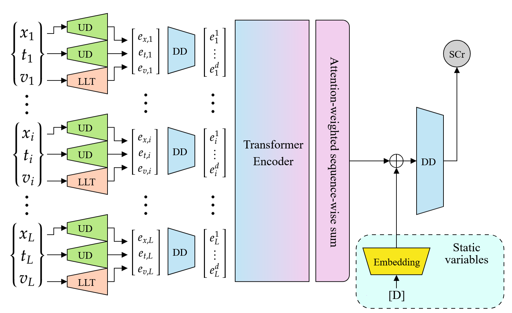

# T-MITS

This repository is the official implementation for _Multivariable Serum Creatinine Forecasting for Acute Kidney Injury Detection Using an Explainable Transformer-based Model_, by [Cyprien Gille](mailto:cyprien.gille@umons.ac.be), Galaad Altares, Benjamin Colette, Karim Zouaoui Boudjeltia, Matei Mancas and Virginie Vandenbulcke (EMBC 2025).



## Repository Contents

All relevant files should have a docstring at the top and extensive comments to tell you what they do, but you can find an overview of the contents of this repository below.

| File                                     | Description                                                                                          | Executable? |
| ---------------------------------------- | ---------------------------------------------------------------------------------------------------- | :---------: |
| culling_reg.py                           | Task-aware postprocessing script that removes unusable measures and stays after preprocessing        |     Yes     |
| eval_kfold_TMITS.py                      | Computes metrics for a trained T-MITS model                                                          |     Yes     |
| kfold_TMITS.py                           | Trains a T-MITS model with cross-validation (optional)                                               |     Yes     |
| preprocess_eicu.py                       | Task-agnostic eICU preprocessing                                                                     |     Yes     |
| preprocess_mimic.py                      | Task-agnostic MIMIC-IV preprocessing using pre-selected variables                                    |     Yes     |
| .gitignore                               | Allows for non-tracking of generated files (namely)                                                  |     No      |
| config.py                                | Dataclasses controlling the configuration of the main scripts                                        |     No      |
| pyproject.toml                           | Description of the python project and its dependencies (see [Installing](#installing) section below) |     No      |
| uv.lock                                  | uv lockfile indicating a working set of packages for this repository, for reproducibility            |     No      |
| dataset_classes/dataset_base.py          | Base ICU torch Dataset class                                                                         |     No      |
| dataset_classes/dataset_regression.py    | ICU torch Dataset class intended for regression                                                      |     No      |
| models/attention.py                      | Basic attention torch module                                                                         |     No      |
| models/loss.py                           | Quantile Loss torch module                                                                           |     No      |
| models/tmits.py                          | T-MITS torch module                                                                                  |     No      |
| models/transformer.py                    | Transformer wrapper torch module                                                                     |     No      |
| models/UD.py                             | Up-dimensional embedding torch module                                                                |     No      |
| utility_functions/eval_utils.py          | Utility functions used for evaluation                                                                |     No      |
| utility_functions/preprocessing_utils.py | Utility functions used for preprocessing (includes the pre-selected variables for preprocessing)     |     No      |
| utility_functions/utils.py               | Various utility functions                                                                            |     No      |

# Installing

All dependencies for this project are specified in the `pyproject.toml` file, following [PEP 621](https://packaging.python.org/en/latest/specifications/pyproject-toml/#pyproject-toml-spec).

### With uv (recommended)

You can install dependencies using the [uv python package manager](https://docs.astral.sh/uv/), a modern replacement for all of conda's features (and more). To do so, simply [install uv](https://docs.astral.sh/uv/getting-started/installation/) and run the following command in this repository:

```sh
uv sync
```

This will create a virtual environment for this project and install its dependencies. This is the recommended and maintained way to setup this repository.

### With pip

Since `pyproject.toml` is a standard format, you can also install this project by simply running the following command. We would advise you to do so in a virtual environment.
Note that this method is not recommended because it might not install the best version of pytorch for your hardware (because [pytorch has its own indexes](https://docs.astral.sh/uv/guides/integration/pytorch/)), among other things.

```sh
pip install .
```

# Pipeline

## 1. Data Preprocessing

### Datasets and directory structure

All results presented in our paper were obtained on either the [MIMIC-IV](https://physionet.org/content/mimiciv/2.2/) dataset or the [eICU-CRD](https://physionet.org/content/eicu-crd/2.0/) dataset, which can both be obtained freely after following a quick training. Instructions can be found at the bottom of the two previous links.

Once obtained, the datasets should be placed in the same root directory as this repository, as such :

```
<top-directory>/
├── mimic-iv-2.2/
│   ├── icu/
│   ├── hosp/
│   ├── ...
├── eicu-crd-2.0/
│   ├── lab.csv
│   ├── ...
├── T-MITS/
│   ├── dataset_classes/
│   ├── ...
```

If you wish to place them elsewhere, you will have to modify the paths at the start of the preprocessing scripts.

### Files to decompress

If you don't want to decompress every file in each dataset to save space, you can just decompress the following files:

- In the `mimic-iv-2.2/` directory:
  - `hosp/admissions.csv`
  - `hosp/patients.csv`
  - `icu/chartevents.csv`
- In the `eicu-crd-2.0/` directory:
  - `lab.csv`
  - `vitalPeriodic.csv`
  - `patient.csv`

### Running preprocessing scripts

All preprocessing scripts produce two `.csv` files: the dataset and a **key** mapping the original variable labels (such as "Heart Rate") to their reindexed integer ids. This is mainly used to tell scripts (culling, training) which variable interests you without having to know its internal id.

To get the bottom-up (29 variables) or top-down (206 variables) versions of the processed MIMIC-IV dataset, set the `top_down` flag at the top of `preprocess_mimic.py` and run it:

```sh
uv run preprocess_mimic.py
```

To get the processed eICU-CRD dataset, run:

```sh
uv run preprocess_eicu.py
```

## 2. Data post-processing (culling)

Preprocessing is task-agnostic, so you still need to remove from the preprocessed dataset all stays and measures that are unusable for your task. For example, this includes stays with no regression target.

The culling script is also used to create cohorts based on several criteria, such as the first value of the target variable in a stay, which variable should be maskable during training without creating empty stays, or the maximum length of a stay. Note that by default, cohort-defining parameters that are changed from their defaults will be added to the output filename for clarity (see `attr_in_paths` in `CullingConfig` in `config.py`).

To cull a dataset, adjust the `CullingConfig` at the top of `culling_reg.py` and run it.

```sh
uv run culling_reg.py
```

This will produce a ready-to-use `.csv`. It _can_ also split each stay into separate `.csv` files (can be faster than filtering the dataset during training), and save the classification label of each stay (useful for stratified splitting) in a `.json` dictionnary.

## 3. Training

As always, adjust the `TrainingConfig` at the top of the script and run it:

```sh
uv run kfold_TMITS.py
```

This will produce:

- A record of the training config (`.json`)
- A logfile of the training process (`.log`)

For each cross-validation fold, this will produce:

- Best model checkpoints (`.pth`)
- A record of the training and testing indices as numpy arrays (`.npy`)

## 4. Evaluating

As always, adjust the `EvalConfig` at the top of the script and run it:

```sh
uv run eval_kfold_TMITS.py
```

This will reuse the saved training config to evaluate the trained model.

If all config booleans are set to True, this will produce (for the train set and the test set):

- Regression and classification metrics (`.csv`)
- Normalized confusion matrices
- Ground truth and Predicted value arrays, both for regression and for classification (`.npy`) (aligned with the stay indexes saved during training right after splitting)
- An `.xlsx` sheet with columns for the stay id, the true and predicted values, and the true and predicted classes.

### Decoupled Evaluation Data

You can also call this script's `main` function with a path to a culled cohort as the `data_override` argument: this allows for the evaluation of a model on a _different_ cohort than the one it was trained on (for example, train on stays that started in stage 0, and evaluate on stays that ended in stages 1 2 or 3). Note however that if none of the test indexes used during the training process are in the overriding cohort, the script will raise an error.

# Reference

The _bibtex_ reference to our paper will be added here and as a CITATION file after publication of the EMBC proceedings.

# License

The code in this repository is available under a [CC-BY-SA 4.0](https://creativecommons.org/licenses/by-sa/4.0/) (Creative Commons Attribution-ShareAlike 4.0 International Public License) [license](LICENSE.md).
